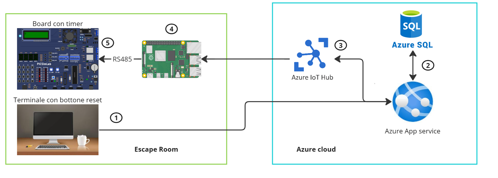
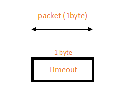
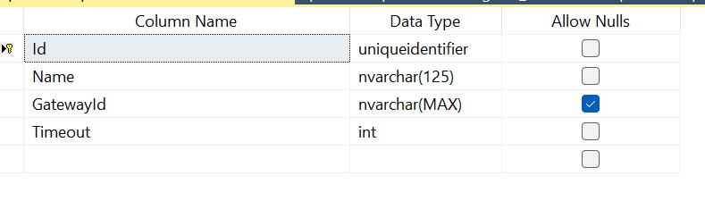

# Esame QZER2023 - Spironelli Riccardo


## Contesto
Un'azienda ha come offerta di intrattenimento delle escape room, si richiede un'applicazione web con un tasto che consenta a questi ultimi di resettare il conteggio del timer all'interno della stanza.

## Tecnologie usate
>Il provider cloud è [Microsoft Azure](https://azure.microsoft.com/en-us/)
- WebApp: [AspNetCore](https://dotnet.microsoft.com/apps/aspnet)
- Database: [AzureSql](https://azure.microsoft.com/en-us/services/sql-database/)
- IotDeviceCommunication: [AzureIoTHub](https://azure.microsoft.com/en-us/services/iot-hub/)
<br>

- IotGateway: [NodeJs]()
- IotDevice: [PIC16F877A](https://www.microchip.com/wwwproducts/en/PIC16F877A) on [custom board](https://lcgamboa.github.io/picsimlab_docs/0.8.11/pdf/boards/PICGenios.pdf)


## Architettura e action flow
1. L'utente preme il tasto di reset sulla webapp
2. Viene eseguita una query, che in base alla stanza in cui ci si trova restituisce il timeout e l'id del gateway
3. I dati vengono inviati tramite IotHub al gateway corretto
4. Il gateway converte il dato ricevuto da JSON a seriale e lo invia tramite RS485
5. Il pic riceve il timeout e resetta il timer (solo se è in corso).
6. Se il timer raggiunge il timeout il display mostra la scritta `catastrofe in arrivo` e necessita di un hard reset per ripartire.

> ⚠️ Il valore del timeout non può superare `255`

L'immagine illustra l'architettura dell'applicazione

 
<div style="page-break-after: always;"></div>

## Protocollo
- #### Protocollo livello fisico
 Tutte le comunicazioni tra il gateway e la scheda sono effettuate su protocollo [RS-485](https://www.ti.com/lit/an/slla272d/slla272d.pdf?ts=1688782236932) in modalità half-duplex, quindi un solo doppino è necessario. 
 
 **Ogni scheda deve avere un gateway**

  Per connettere la scheda al gateway è necessario un adattatore RS485
  - Sulla scheda l'integrato [SN75176AP](https://www.ti.com/product/SN75176A) è connesso alla UART del PIC.
  -  Sul gateway l'integrato [FTDI233RL](https://ftdichip.com/products/ft232rl/) - [MAX485](https://www.analog.com/en/products/max485.html) è connesso alla porta USB del Raspberry Pi.
  
  I parametri usati per la connessione sono:
  ```
  Baud rate: 115200
  Data bits: 8
  Stop bits: 1
  Parity: None
  Flow control: None
  ```
- #### Protocollo data Link Layer
  Il pacchetto è composto da un byte che contiene il timeout impostato dal backend.

  
  
  ##### Packet structure
  
  
  ##### Packet code example
  ```c
    packet_t packet;
    packet.timeout = 10;
  ```
<div style="page-break-after: always;"></div>

## Comunicazione tra gateway e backend
La comunicazione tra gateway e backend è effettuata usando [Azure Iot Hub](https://azure.microsoft.com/en-us/services/iot-hub/). 


I pacchetti sono ricevuti dal' IotHub come JSON quindi è necessario fare deserializzarli e convertirli in uno stream di byte da inviare alla scheda tramite seriale.


#### Struttura JSON
- C2D
  - Set del timeout
    ```json
    {
      "timeout": 10
    }
    ```
### Configurazione e startup
- #### Board
  >Assicurarsi che la frequenza di clock sia `16MHz`
  
  Una volta che il timer si è esaurito è necessario premere il tasto `RESET` sulla scheda. Quest'ultima utilizzerà l'ultimo valore di timeout impostato, nel caso in cui questo sia 0, 255 verrà impostato.
  Anche se il tempo è esaurito, il timeout è comunque impostabile da interfaccia web.

- #### IoT Gateway
  - Installazione typescript `npm i -g typescript`
  - Installazione dipendenze `npm i`
  - Compilazione `tsc`

  Creare poi un file `.env` nella root directory che contenga le seguenti chiavi:
  - `COMPORT` - Il nome della porta seriale a cui è connessa la board
  - `IOTHUB_DEVICE_CONNECTION_STRING` - La stringa di connessione dell'iot hub

## Backend/Cloud
  Il backend ha un repository per accedere (in sola lettura) all'unica tabella del db.

  Quando un utente naviga nella index, il repository precedentemente citato verrà interrogato ed una tabella contenente tutte le stanze sarà mostrata.

  Cliccando su una stanza si verrà reindirizzati e comparirà il bottone di reset, una volta cliccato il messaggio di reset verrà inviato all'IotHub tramite IotHubService;

  

  Nel file `appsetting.json` impostare le due stringhe di connessione come mostrato sotto:
  ```JSON
   "ConnectionStrings": {
    "db": "", //stringa connessione database azure sql
    "IotHub": "" // stringa di connessione IotHub
  }
  ```

