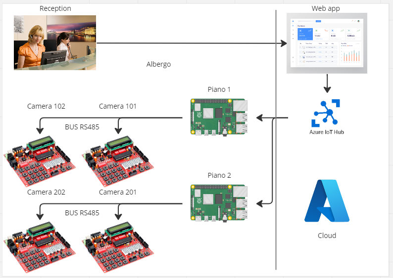

# Simulazione esame QZER 2023 Spironelli Riccardo

### Schema logico

### Protocollo
La comunicazione tra la scheda e il gateway è stata implementata tramite protocollo custom che si compone di:
- 1 byte per l'indirizzo della scheda (quindi ogni gateway può gestire fino a 255 schede)
- 16 byte per il messaggio (quindi ogni messaggio può essere lungo come una riga del display)
- 1 byte per l'ora al quale il messaggio deve cancellarsi
- 1 byte per il minuto al quale il messaggio deve cancellarsi
